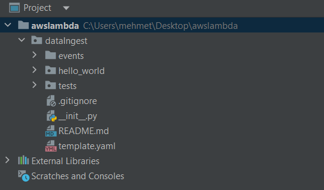
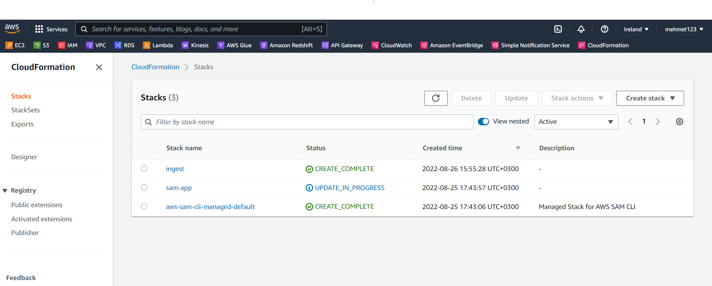
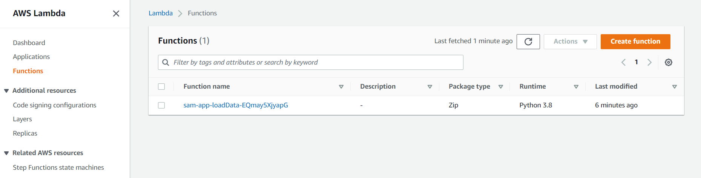
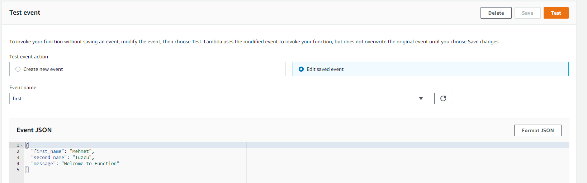
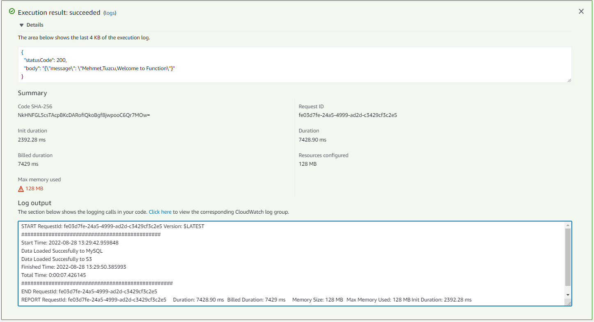

# Data Ingest Project with AWS Lambda

### What is Serverless?
Serverless are systems where developers can deploy any system by developing on the cloud without using hardware and network infrastructure.
AWS lambda will be used in this project. Work will be done on how to deploy a local code to AWS lambda. Project purpose: We will make an example of how to import data to Amazon RDS with AWS Lambda by pulling data from API. We will learn how to use AWS SAM, which is one of the most important steps.

This project will contain source code to support SAM CLI.

- dataIngest - Code for the application's Lambda function.
- events - Invocation events that you can use to invoke the function.
- template.yaml - A template that defines the application's AWS resources.

### Deploy the application

To use the SAM CLI, you need the following tools.
The purpose of downloading Docker is to run the code locally.
You can download one of these versions as it supports versions 3.6 to 3.9 while running on AWS lambda.

* SAM CLI - [Install the SAM CLI](https://docs.aws.amazon.com/serverless-application-model/latest/developerguide/serverless-sam-cli-install.html)
* [Python 3 installed](https://www.python.org/downloads/)
* Docker - [Install Docker community edition](https://hub.docker.com/search/?type=edition&offering=community)


### Enviroment variables
After downloading the applications, we can check the environment variables settings and make them work from all paths.

### Creating the working file
```bash
C:\Users\mehmet\Desktop>mkdir awslambda
```
```bash
C:\Users\mehmet\Desktop>cd awslambda
```

We will be able to deploy our code locally with AWS sam. First, let's log in to our account with the AWS CLI.
We will create users with AWS Identity and Access Management. You can give full admin for this user's permissinons privileges. You can learn how to create users and access Access information from the following resource.

* IAM-[WS Identity and Access Management](https://docs.aws.amazon.com/IAM/latest/UserGuide/getting-started_create-admin-group.html)

### SAM-CLI

```bash
C:\Users\mehmet\Desktop\awslambda> aws configure
AWS Access Key ID [****************ADGQ]:
AWS Secret Access Key [****************NSDK]: 
Default region name [eu-west-1]: 
Default output format [None]: 
PS C:\Users\mehmet\Desktop\awslambda>
```

We will init the SAM. We will need some files to be able to deploy to AWS Lambda. We can use the Hello-World function in SAM to have ready access to these files.

```bash
C:\Users\mehmet\Desktop\awslambda> sam init
```

* Step-1
```bash
Which template source would you like to use?
        1 - AWS Quick Start Templates       
        2 - Custom Template Location        
Choice: 1
```

* Step-2
```bash
Choose an AWS Quick Start application template
        1 - Hello World Example
        2 - Multi-step workflow
        3 - Serverless API     
        4 - Scheduled task
        5 - Standalone function
        6 - Data processing
        7 - Infrastructure event management
        8 - Lambda EFS example
        9 - Machine Learning
Template: 1
```
* Step-3
```bash
Use the most popular runtime and package type? (Python and zip) [y/N]: N
```

* Step-4
```bash
Which runtime would you like to use?
        1 - dotnet6
        2 - dotnet5.0
        3 - dotnetcore3.1
        4 - go1.x
        5 - graalvm.java11 (provided.al2)
        6 - graalvm.java17 (provided.al2)
        7 - java11
        8 - java8.al2
        9 - java8
        10 - nodejs16.x
        11 - nodejs14.x
        12 - nodejs12.x
        13 - python3.9
        14 - python3.8
        15 - python3.7
        16 - python3.6
        17 - ruby2.7
        18 - rust (provided.al2)
Runtime: 14
```
* Step-5
```bash
What package type would you like to use?
        1 - Zip
        2 - Image
Package type: 1
```
* Step-6
```bash
Would you like to enable X-Ray tracing on the function(s) in your application?  [y/N]: N
```
* Step-7
```bash
Project name [sam-app]: dataIngest
```
* Data Ingest folder has been created under the aws lambda project. There are files in it that we need to work on.




## File Descriptions
- [events](events/event.json) - `Invocation events that you can use to invoke the function.`

```json
{
  "first_name": "Mehmet",
  "second_name": "Tuzcu",
  "message": "Welcome to Function"
}
```
- code file - `Code for the application's Lambda function.`
- [app.py](code/app.py)
- [requirements.txt](requirements.txt)
- [template.yaml](template.yaml) - `A template that defines the application's AWS resources.`


* After making the necessary arrangements on the files, we can send our code to aws lambda.


## Use the SAM CLI to build and test locally

Build your application with the `sam build ` command.

```bash
dataIngest$ sam build
```

The SAM CLI installs dependencies defined in `code/requirements.txt`, creates a deployment package, and saves it in the `.aws-sam/build` folder.

Test a single function by invoking it directly with a test event. An event is a JSON document that represents the input that the function receives from the event source. Test events are included in the `events` folder in this project.

Run functions locally and invoke them with the `sam local invoke` command.

```bash
dataIngest$ sam local invoke loadData --event events/event.json
```

* Here we can check that the code is working. Next we need to send it to the aws lambda.

```bash
dataIngest$ sam deploy --guided              
```

* While deploying to AWS Lambda, we are making some configuration settings.
```bash
Configuring SAM deploy
======================

        Looking for config file [samconfig.toml] :  Found
        Reading default arguments  :  Success

        Setting default arguments for 'sam deploy'
        =========================================
        Stack Name [sam-app]:
        AWS Region [eu-west-1]:
        #Shows you resources changes to be deployed and require a 'Y' to initiate deploy
        Confirm changes before deploy [Y/n]: Y
        #SAM needs permission to be able to create roles to connect to the resources in your template
        Allow SAM CLI IAM role creation [Y/n]: Y
        #Preserves the state of previously provisioned resources when an operation fails
        Disable rollback [Y/n]: Y
        Save arguments to configuration file [Y/n]: Y
        SAM configuration file [samconfig.toml]: 
        SAM configuration environment [default]: 

```

```bash
Deploy this changeset? [y/N]: y
```

* After making the configuration settings, we can review the status on AWS CloudFormation.



```bash
2022-08-28 16:25:53 - Waiting for stack create/update to complete

CloudFormation events from stack operations (refresh every 0.5 seconds)
-------------------------------------------------------------------------------------------------------------------------------------------------------------------------------------------------------------------------------------   
ResourceStatus                                            ResourceType                                              LogicalResourceId                                         ResourceStatusReason
-------------------------------------------------------------------------------------------------------------------------------------------------------------------------------------------------------------------------------------   
UPDATE_IN_PROGRESS                                        AWS::CloudFormation::Stack                                sam-app                                                   User Initiated
UPDATE_IN_PROGRESS                                        AWS::Lambda::Function                                     loadData                                                  -                                                       
UPDATE_COMPLETE                                           AWS::Lambda::Function                                     loadData                                                  -                                                       
UPDATE_COMPLETE_CLEANUP_IN_PROGRESS                       AWS::CloudFormation::Stack                                sam-app                                                   -                                                       
UPDATE_COMPLETE                                           AWS::CloudFormation::Stack                                sam-app                                                   -                                                       
-------------------------------------------------------------------------------------------------------------------------------------------------------------------------------------------------------------------------------------

Successfully created/updated stack - sam-app in eu-west-1

```

## AWS Lambda
* We can examine our Function on AWS Lambda.



* I am creating an event to run the function.



* We can test our function and observe the log output



## Resources

See the [AWS SAM developer guide](https://docs.aws.amazon.com/serverless-application-model/latest/developerguide/what-is-sam.html) for an introduction to SAM specification, the SAM CLI, and serverless application concepts.

Next, you can use AWS Serverless Application Repository to deploy ready to use Apps that go beyond hello world samples and learn how authors developed their applications: [AWS Serverless Application Repository main page](https://aws.amazon.com/serverless/serverlessrepo/)
